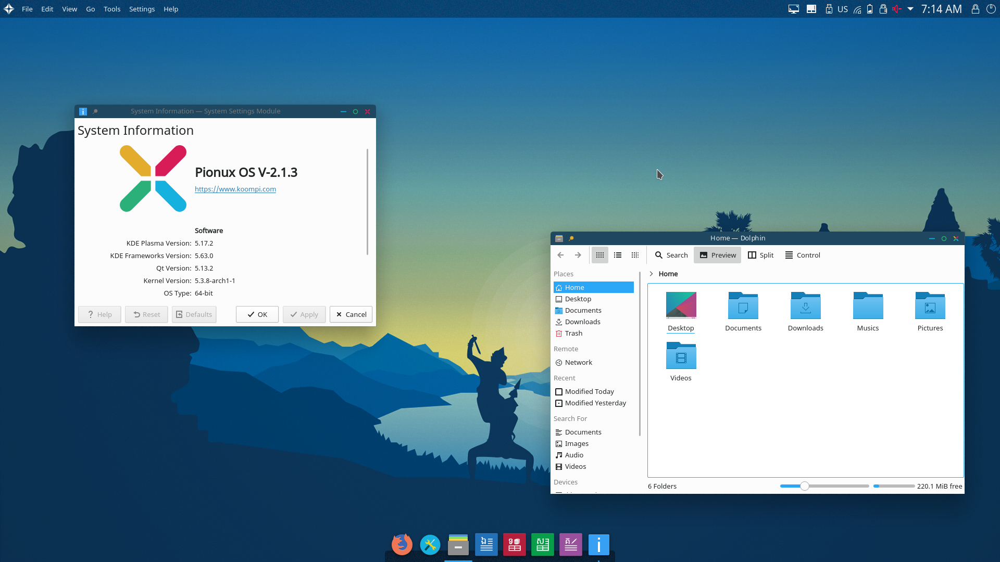

# Pionux

<div style="text-align:center"></div>

[Pionux](pionux.com) is a fully customized and self-customizable Cambodia based open-source operating system software solution for up and coming engineers, inventors, organizers, developers and basically free thinkers in a modern-day post-Microsoft world.

## Documentations

You will find all the documentation to help you with Pionux.

### To run the documentation locally

#### Getting started

```text
# Install the project
git clone https://github.com/koompi/users-guide.git
cd user-guide
npm i
```

#### Start the project

```text
# Run the documentation locally
in the terminal: `npm start`
```

## Features

[//]: # (TODO: ask bong Brilliant)

### Screenshots



### Goals

[//]: # (TODO: ask bong Rithy)

## Community

-   Pionux OS on [Github](https://github.com/pionux/pionuxos)
-   Pionux [Repo]()
-   Pionux [Website](https://pionux.org/)

## FAQs

[//]: # (TODO: ask bong Brilliant)

## Contributors

Thanks goes to these wonderful people ([emoji key](https://allcontributors.org/docs/en/emoji-key)):

[//]: # (TODO: update icons, add more ask bong Rithy)
<table>
<tr>
    <td align="center"><a href="https://github.com/rithythul"><br /><sub><b>Rithy Thul</b></sub></a><br /><a href="#question-kentcdodds" title="Answering Questions">💬</a><a href="https://github.com/all-contributors/all-contributors/commits?author=kentcdodds" title="Documentation">📖</a><a href="#review-kentcdodds" title="Reviewed Pull Requests">👀</a> <a href="#talk-kentcdodds" title="Talks">📢</a></td>
    <td align="center"><a href="https://github.com/mrayoung"><br /><sub><b>Mr.Ayoung</b></sub></a><br /><a href="https://github.com/all-contributors/all-contributors/commits?author=jfmengels" title="Documentation">📖</a><a href="#review-jfmengels" title="Reviewed Pull Requests">👀</a><a href="#tool-jfmengels" title="Tools">🔧</a></td>
    <td align="center"><a href="https://github.com/san-vuthy"><br /><sub><b>San Vuthy</b></sub></a><br /><a href="https://github.com/all-contributors/all-contributors/commits?author=jfmengels" title="Documentation">📖</a><a href="#review-jfmengels" title="Reviewed Pull Requests">👀</a><a href="#tool-jfmengels" title="Tools">🔧</a></td>
    <td align="center"><a href="https://github.com/mrrbrilliant"><br /><sub><b>Phal Brilliant</b></sub></a><br /><a href="https://github.com/all-contributors/all-contributors/commits?author=jfmengels" title="Documentation">📖</a><a href="#review-jfmengels" title="Reviewed Pull Requests">👀</a><a href="#tool-jfmengels" title="Tools">🔧</a></td>
     <td align="center"><a href="https://github.com/cbun097"><br /><sub><b>Claire Bun</b></sub></a><br /><a href="https://github.com/all-contributors/all-contributors/commits?author=jfmengels" title="Documentation">📖</a><a href="#review-jfmengels" title="Reviewed Pull Requests">👀</a><a href="#tool-jfmengels" title="Tools">🔧</a></td>
  </tr>
  <tr>
    <td align="center"><a href="https://github.com/tellsela"><br /><sub><b>Tell Sela</b></sub></a><br /><a href="https://github.com/all-contributors/all-contributors/commits?author=jfmengels" title="Documentation">📖</a><a href="#review-jfmengels" title="Reviewed Pull Requests">👀</a><a href="#tool-jfmengels" title="Tools">🔧</a></td>
    <td align="center"><a href="https://github.com/SCSW"><br /><sub><b>Seang Hengsrun</b></sub></a><br /><a href="https://github.com/all-contributors/all-contributors/commits?author=jfmengels" title="Documentation">📖</a><a href="#review-jfmengels" title="Reviewed Pull Requests">👀</a><a href="#tool-jfmengels" title="Tools">🔧</a></td>
  </tr>
</table>

## Resources

-   Pionux OS on [Github](https://github.com/pionux)
-   Pionux on [Facebook](https://www.facebook.com/koompi/)
-   Pionux on [Telegram](https://t.me/koompi)
-   Pionux on [YouTube](https://www.youtube.com/channel/UC_j4WMcUMt9QsUphFYAsQpg)
-   Our team [email](mailto:pi@koompi.com)

## License

[GNU GPLv3](LICENCE)
